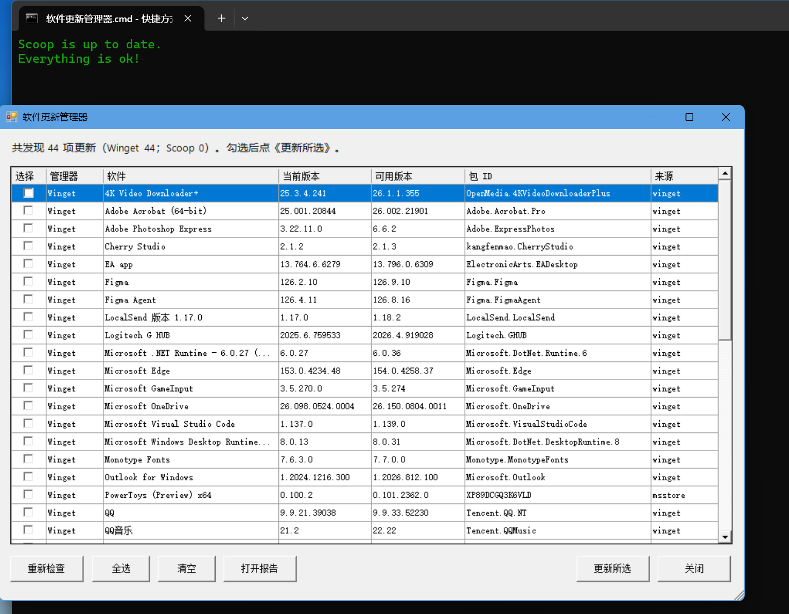

# 软件更新管理器

[English](README.md) | 简体中文

一个轻量、透明、可读的 Windows 软件更新提醒工具，版本 v0.1.0。它把 Winget 和 Scoop 的待更新列表放到同一个 WinForms 窗口中，供用户自行选择更新项。源码是 PowerShell 脚本，无需 Node.js、Python 或额外框架。

## 为什么做这个项目

Windows 上的软件可能分别由 Winget 和 Scoop 管理。这个工具提供一个统一的检查与选择入口，保留原生包管理器的安装流程。相比 UniGetUI，本项目更轻、更透明，PowerShell 源码可直接阅读，不追求完整软件中心功能。

## 功能

- 检查 Winget 和 Scoop 待更新软件，显示软件名、当前版本、可用版本、包 ID 和来源。
- 勾选指定软件，确认后才在独立窗口执行所选更新；支持全选、清空、重新检查。
- 每次成功检查后生成 `software-updates-latest.txt`；可在 GUI 中打开报告。
- `-CheckOnly` 后台检查模式：发现更新时显示 Windows 通知，不安装软件。
- 安装脚本创建当前用户登录时触发、延迟 1 分钟的任务计划，不设置重复触发。

## 界面截图



## 环境与安装

当前仅在 Windows + Windows PowerShell 5.1 环境充分测试。需要系统可使用 Winget 和/或 Scoop。下载或克隆本项目后，在项目目录运行：

```powershell
powershell.exe -NoProfile -ExecutionPolicy Bypass -File .\Install.ps1
```

脚本会先说明安装动作，然后将 `SoftwareUpdateManager.ps1` 复制到 `%USERPROFILE%\SoftwareUpdateManager\`，在 `%USERPROFILE%\Desktop\` 创建 `Software Update Manager.cmd`，并为当前用户创建 `SoftwareUpdateManager-v0.1.0` 任务计划。报告也保存在该安装目录。安装不会更新软件。遇到同名但内容不同的文件或任务，安装会停止，避免覆盖。再次运行相同版本安装脚本不会重复创建任务。

安装脚本不会操作旧版 `Scripts` 目录中的脚本和现有桌面快捷方式。

## 使用

双击桌面上的 `Software Update Manager.cmd`。检查完成后，勾选要更新的软件，点“更新所选”并再次确认。更新命令在新的 PowerShell 窗口执行；结束后回到 GUI 点“重新检查”核对结果。包管理器可能仍会显示安装确认或权限提示。

手动运行后台检查：

```powershell
powershell.exe -NoProfile -STA -ExecutionPolicy Bypass -WindowStyle Hidden -File "$env:USERPROFILE\SoftwareUpdateManager\SoftwareUpdateManager.ps1" -CheckOnly
```

后台任务使用同一 `-CheckOnly` 模式，只刷新 Scoop 元数据、查询待更新列表、写报告，并在有更新时显示通知。`scoop update` 不带包名用于刷新 Scoop 与 bucket 元数据，不会执行 `scoop update *`。

## 卸载

在下载或克隆的项目目录运行：

```powershell
powershell.exe -NoProfile -ExecutionPolicy Bypass -File .\Uninstall.ps1
```

卸载脚本只删除本项目的任务计划、桌面入口和已安装的程序文件。若有报告，会明确询问是否删除；默认保留。已修改的安装文件、桌面入口或任务不会被盲目删除。卸载不会触碰 Winget、Scoop 或其他用户文件。

## 安全设计与已知限制

- 默认绝不执行 `winget upgrade --all` 或 `scoop update *`。安装与更新软件必须由用户在 GUI 中选择并确认。
- Winget 与 Scoop 的包和来源分别由其软件源维护；使用前仍应核对包 ID、来源和安装提示。
- Winget 表格是人类可读输出，不是稳定的机器接口；列宽、语言或版本变化可能使某些条目无法识别。遇到检查命令失败时会报错，并保留上次成功报告。
- Winget 显示的“可用版本”是其软件源提供的版本，不保证等于厂商内置稳定通道的最新版。
- GUI 检查期间会暂时无响应；通知依赖当前用户的交互式登录会话及系统通知设置。
- 本版本未在其他语言、重定向桌面或所有 Winget/Scoop 版本组合中充分验证。桌面入口使用 `%USERPROFILE%\Desktop`。

## 文件

- `SoftwareUpdateManager.ps1`：GUI、检查、报告、通知与选择性更新。
- `Install.ps1` / `Uninstall.ps1`：当前用户安装与卸载。
- `screenshots/`：功能截图位置。

许可证：MIT。详见 [`LICENSE`](LICENSE)。
